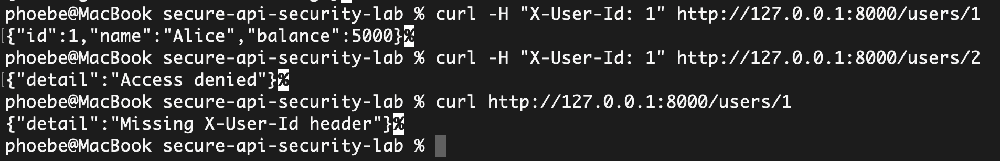
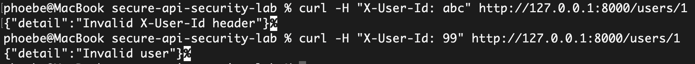

# Secure API Security Lab

A small hands-on API security project demonstrating a Broken Access Control / IDOR-style vulnerability and its remediation using basic authentication and authorization checks in FastAPI.

## Project Scope

This lab includes:
- a vulnerable API version
- a remediated API version
- curl-based security testing
- screenshots of authorization test results

## Security Tests

### Authorization Tests

The secure API was tested using curl commands to verify authentication and authorization controls.

### Successful request, access denied, and missing header

### Invalid header values

